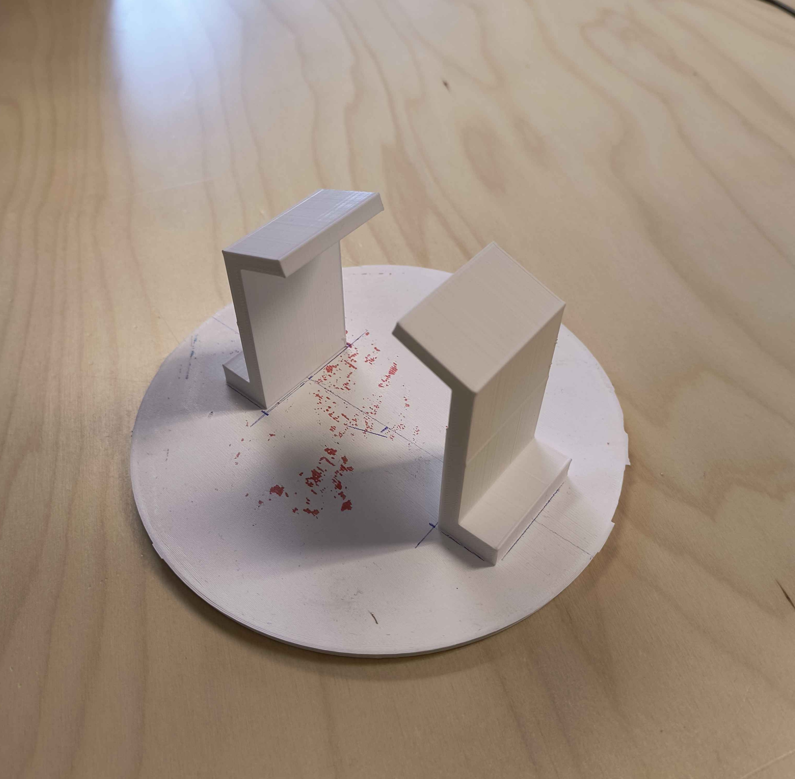
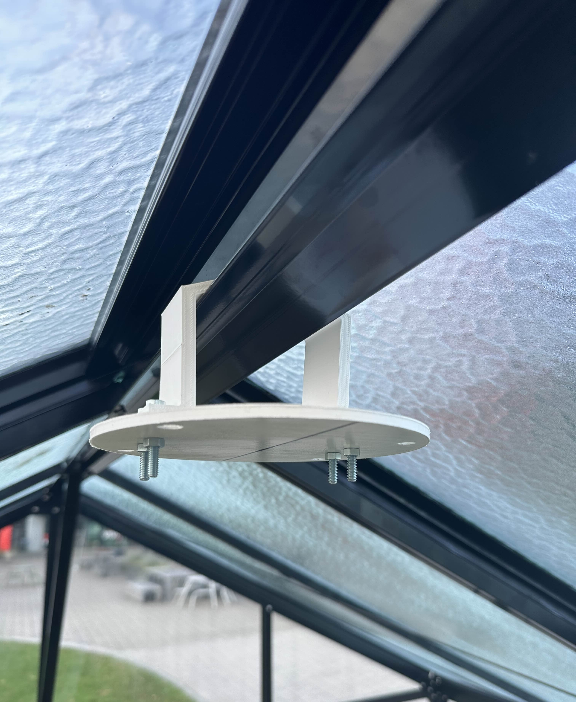

# Greenhouse Security

Op de site campus Brugge Xavarianenstraat komt een serre van 3x6m. Daarbij komt later ook nog een Tiny-house. Dit alles als IoT incubator voor project experience.   
Ons project zal zorgen voor de security en beveiliging van de serre. We maken hiervoor gebruik van bewakings camera's en een toegangs controle systeem.

## Inhoud
- [GreenhouseSecurity](#greenhousesecurity)
  - [Inhoud](#inhoud)
  - [Team](#team)
  - [Features](#features)
  - [Planning](#planning)
    - [Sprint 1](#sprint-1)
    - [Sprint 2](#sprint-2)
    - [Sprint 3](#sprint-3)
    - [Sprint 4](#sprint-4)
  - [Installatie Software](#installatie-software)
    - [Axis Camera Station](#axis-camera-station)
    - [Python](#python)
    - [Raspberry Pi](#raspberry-pi)
  - [Documentatie](#documentatie)
    - [Research](#research)
      - [Toegangssystemen](#toegangssystemen)
        - [NFC](#nfc)
        - [Authenticator](#authenticator)
        - [Biometrisch](#biometrisch)
      - [Camera's](#cameras)
        - [Axis](#axis)
        - [Stappenplan](#stappenplan)
        - [Privacy](#privacy)
      - [Installatie Camera's](#installatie-cameras)
        - [Installatie 360 Dome Camera](#installatie-360-dome-camera)
          - [3D-prints](#3d-prints)
        - [Installatie Fixed Camera](#installatie-fixed-camera)
          - [Montage](#montage)
      - [Installatie Toegangssysteem](#installatie-toegangssysteem)
      - [Project Affiche](#project-affiche)
  - [Code](#code)
  - [Integratie](#integratie)
  - [Pictogram:](#pictogram)
  - [Links](#links)
  - [Erkenningen](#erkenningen)
  - [BOM-Lijst](#bom-lijst)
  - [Research](#research)
## Team

- [Luca De Clerck](https://github.com/LucaClrk)  
- [Xander Claessens](https://github.com/xanderClaessens)   
- [Domien Verstraete](https://github.com/Belgianwafflecorp)

## Features
-  Security beelden van de serre
-  Mogelijkheid om security beelden overal te bekijken
-  Toegang tot serre controleren
-  Mogelijkheid om de deuren te sluiten

## Planning
Onze planning kan je in detail bekijken op [Notion](https://www.notion.so/Project-Management-Tasks-Projects-Planning-15a7c97a744380f28060f6c136deb173?pvs=4).  
Maar hier zullen wij in grote lijnen alles plaatsen wat wij hebben gedaan en wat we zullen doen.  
### Planner
- #### Sprint 1
  - Architectuur document opgesteld
  - Axis Software testen
  - Camera functies testen
- #### Sprint 2
  - VM aanmaken
  - Code schrijven voor Raspberry Pi
  - Elektronisch schema uittekenen
- #### Sprint 3
  - Affiche maken
  - Starten PowerPoint
  - Motion Detection uittesten
  - Netwerk in orde stellen(VLAN)
  - Overleg wetgeving camera's
  - 3D-stukken printen
- #### Sprint 4
  -  Camera's installeren in serre
  -  Toegangssysteem installeren in serre
  -  Programma toegang afwerken
  -  Camera's en Raspberry Pi verbinden met netwerk
  -  Notificaties versturen bij motion detection

## Installatie Software
### Axis Camera Station
Ga naar de [Axis Camera station 5](https://www.axis.com/products/axis-camera-station/download) pagina om de nieuwste versie te downloaden. Hiermee ben je in staat de Axis camera's te beheren.
### Python
Python kan je programmeren via [Visual Studio Code](https://code.visualstudio.com/download) of een andere IDE naar keuze. Bij gebruik van Visual Studio Code kan je de Python extensie installeren om zo te beginnen aan je Python programma.
### Raspberry Pi
Eerst en vooral moet je een [Raspberry Pi](https://www.raspberrypi.com/software/) aankopen. Als het mogelijk is een model 3 of hoger. Hierna kan je via een SD kaart de [Raspberry Pi OS](https://www.raspberrypi.com/software/) installeren op je bordje. Hierna kan je dan via HDMI of DP, te zien welk bordje je hebt, verbinden met de Raspberry Pi. 

## Documentatie
### Research
  - ### Toegangssystemen:
    - #### NFC  
       NFC staat voor Near-Field Communication. Zoals de naam zelf verklapt is dit een manier om communicatie in te schakelen over een kleine afstand. Een set van communicatie protocollen maken het mogelijk om communicatie tussen elektronische apparaten in staat te stellen over een afstand van max 4cm.  
          Dit werkt met enerzijds een zend-/ontvangapparaat met een voeding en anderzijds een object met een chip en antenne, zoals een kaart, die gezamenlijk een NFC-tag hebben. De tag heeft geen voeding nodig omdat hij inductie energie ontvangt van het apparaat.  
          NFC wordt in veel toepassingen gebruikt. Denk aan betalingtransacties,sleutelhanger voor toegangscontrole...  

      NFC is dus een mogelijke optie voor toegangscontrole tot de serre. Je kan dan met een NFC-tag de serre openen. Bijvoorbeeld aan de hand van je GSM en een simpele RFID-chip.  
    - #### Authenticator  
        Een authenticator is ook een manier om toegangscontrole toe te passen. Denk aan de google authenticator die je constant codes geeft die veranderen. Dit zorgt voor een veilige manier van toegangscontrole omdat je "wachtwoord" tot de serre voor iedereen anders is en constant verandert. Ook is er geen nood aan een kaart of dergelijke, die je mogelijks kan verliezen.  
    - #### Biometrisch  
        Biometrie betekent letterlijk "meten van de levenden" en verwijst in een hele brede zin naar de studie van levende wezens. Wij zullen deze studies toepassen om een biometrisch toegangscontrole systeem te maken.  
        Biometrie kan je "meten", denk aan je vingerafdruk, irispatroon, gelaatstrekken of DNA. Wij zullen niet zo ver gaan als DNA, maar iets zoals je vingerafdruk kan zeker zorgen voor een goeie beveiliging.
        Een toegangskaart of tag zoals bij NFC kan je verliezen, je vinger zal je niet zo rap verliezen.
        Jammer genoeg zullen zij niet aan biometrie doen omdat deze gegevens moeten opgeslaan worden. Door de privacy wet mogen wij dit soort gegevens niet opslaan.

- ### Camera's
    - #### Axis   
      Wij werden Axis camera's aangeboden van de opleiding Elektronica-ICT. Axis is een Zweedse manufacturer die zich spezialiseert in het verkopen van camera's, access control en netwerk audio apparaten voor bedrijven. We werken dus met een high end camera systeem die bedoelt is voor industriële bedrijven. Deze camera's komen met geïntegreerde software en software van Axis zelf die we kunnen gebruiken voor heel wat doeleinden.  
      Met de software zijn we in staat om beelden te streamen, op te nemen en zelfs motion detection toe te passen.
    - #### Stappenplan  
      Het is heel gemakkelijk om deze apparaten operationeel te maken.  
      Installeer eerst de Axis Software die u nodig acht voor het gebruik van de camera's. Wij hebben hiervoor Axis Camera Station 5 gebruikt.  
      Plug de camera's in via Ethernet in je netwerk en na een paar minuten zouden deze moeten verschijnen in de applicatie.  
      In de applicatie kan u dan kiezen wat u met deze camera's wilt doen.  
    - #### Privacy  
      Omtrent de wet van de privacy zijn er heel wat wettem over het gebruik van camera's. Uiteraard moeten wij met al deze wetten rekening houden tijdens het maken van dit project.  
      Om dit te verduidelijken kan u een kijkje nemen in ons document "[info](./Wetgeving/info.md)".

    - #### Melding wanneer iemand het gebied betreed of inlogt
        - SMS
        - Mail
## Installatie Camera's

-  ### Installatie 360 Dome Camera
  -  ### 3D-prints
      Om de camera in de serre te plaatsen hebben wij 3D-stukken aangevraagd. Deze 3D-prints hebben wij zelf getekend in AutoDesk Inventor.  

      
          
        
      
      De arm stukken zullen we gebruiken om te monteren aan het dak. De voet kunnen we dan monteren aan deze armen. Na deze installatie kunnen we gemakkelijk de camera aan de voet monteren voor een stabiele installatie.  

        
      

-  ### Installatie Fixed Camera
De fixed camera komt op het dak te staan. Om dit te doen hebben we iets stevig nodig om de camera te monteren. Dit stuk zal ook tegen de diverse weersomstandigheden bestand moeten zijn.  
Daarom hebben wij geopteerd voor bandijzer. Dit is een plaat ijzer met gaten in die buigbaar en waar je kan door boren.   
  - #### Montage
  Dit bandijzer hebben wij zo geplooid dat dit op de railing van het dak zal komen. Dit zal er zo uitzien :

    

## Installatie Toegangssysteem
Om het toegangssysteem te installeren gebruiken wij 4 solenoïden die als een slot werken voor de deuren. Een solenoide is een pin die geactiveerd wordt als deze onder spanning komt te staan.
Hij doet dat aan de hand van een veer.  
  
De deuren van de serre zijn schuifdeuren, hierdoor hebben wij geopteerd om deze sloten telkens aan de onderkant te plaatsen. Hierdoor kan je de deur niet openen als het slot niet naar beneden is.
De solenoïden worden aangestuurd via een relais. Je kunt ervoor kiezen om deze normally closed of normally open te hebben. Wij zouden opteren voor normally closed zodat ze niet constant onder spanning komen te staan.  

  

## Project Affiche
Voor het project werden wij gevraagd om een affiche te maken. Deze affiche bevat de titel van het project, een korte beschrijving, de vaardigheden die werden gebruikt voor het project te realiseren een paar foto's. Met dit affiche is het de bedoeling om ons project zo aantrekkelijk mogelijk te maken en gemakkelijk uit te leggen over wat dit gaat.

## Code
#### Authenticatie op Raspberry Pi
In de [Setup](./Documenten/setup.md) file Kan je lezen welke libraries u zal nodig hebben om het programma te schrijven.  
Met dit programma gebruiken we user input van het numeriek toegangsbordje. Met deze input kunnen we verifiëren als deze persoon wel toegang heeft tot de serie en kunnen we de deuren gesloten of geopend zetten.  

Als je de volledige code wil bekijken kan je dit vinden in de [Code](Code/Authenticator/) folder.

## Integratie
De serre bestaat niet alleen voor het project Security. Er zijn nog heel wat andere projecten die ook rond de serre gaan. Het is dan belangrijk om ervoor te zorgen dat al deze projecten samen kunnen werken.  
Hiermee wordt dan bedoelt dat deze projecten op hetzelfde netwerk werken, elkaar niet storen en als 1 geheel werkt.  
In deze topic zullen we uitleggen hoe wij ervoor zorgen dat ons project geïntegreerd is zodat het kan samenwerken met alle andere projecten.  

Het project Home-Assistant zal ervoor zorgen dat er een netwerk aanwezig is in de serre. Dit netwerk zal ons in staat stellen om de gebruikte camera's voor het project te verbinden met dit netwerk.  
Door dit te doen heeft Home-Assistant de mogelijkheid om de camera beelden te bekijken op hun applicatie. Op deze manier is ons project geïntegreerd met de andere projecten, want home-assistant zorgt voor de integratie van alle projecten.

## Pictogram:
Verplicht pictogram met aanduiding dat er camera bewaking aanwezig is.
Dit staat in het Koninklijk besluit dat dit zo moet (zie links voor meer info). 

## Links
- [Info](https://acd.eu/producten/r308-xh-blackline/)
- [Koninklijk Besluit](https://www.besafe.be/sites/default/files/2022-08/ar_pictogramme_-_version_coordonnee_avec_modif_2020.pdf) 
- [Info](https://www.besafe.be/nl/bewakingscamera/pictogram)
- [Klein pin slot](https://www.credexalarmsystems.eu/nl/eb-004-conas-electric-bolt-lockfor-automatic-doors-failsafe.html)
- [2-kanaals 3V relais module](https://www.kiwi-electronics.com/nl/2-kanaals-3v-relais-module-20106?search=relais)
- [Koninklijk Besluit](https://www.besafe.be/sites/default/files/2022-08/ar_pictogramme_-_version_coordonnee_avec_modif_2020.pdf) 
- [Info](https://www.besafe.be/nl/bewakingscamera/pictogram)
- [Klein pin slot](https://www.credexalarmsystems.eu/nl/eb-004-conas-electric-bolt-lockfor-automatic-doors-failsafe.html)
- [Keypad info](https://learn.adafruit.com/matrix-keypad?view=all)
- [Axis OS](https://www.axis.com/products/axis-camera-station/download) 

## Erkenningen

- [Info](https://acd.eu/producten/r308-xh-blackline/)
- [Koninklijk Besluit](https://www.besafe.be/sites/default/files/2022-08/ar_pictogramme_-_version_coordonnee_avec_modif_2020.pdf) 
- [Pictogram](https://www.besafe.be/nl/bewakingscamera/pictogram)
- [Klein Pin Slot](https://www.credexalarmsystems.eu/nl/eb-004-conas-electric-bolt-lockfor-automatic-doors-failsafe.html)

## BOM-Lijst

| Beschrijving | Hoeveelheid | Prijs (€) |
|--------------|-------------|-------|
| Raspberry pi | 1 | 61,95 |
| Nummeriek | 1 | 7,34 |
| Pictogram | 1 | 2,39 |
| Push-pull solenoids | 4 | 47,80 |
| Montage stukken  | 4 | 9,16 |
| Kables | 7 | 12.39 |
| Aftakdoos | 1 | 12.79 |
| Relais module | 1 | 11.90 |
| Tapbout met moer | 1 | 7,99 |
| Fastener met draadeind | 1 | 3,99 |
| **Total Price** | - |  |

